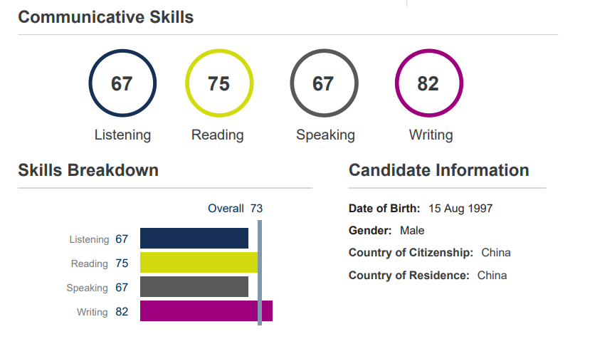



Education
======
* **M.S. in Control Science and Engineering**, Northeastern University, China, 2020.09 - 2023.07  
  * GPA: 6.13/7
  * Thesis: Heterogeneous multi-agent collaborative task allocation and path planning  
* **B.S. in Measurement and Control Technology and Instruments**, Northeast Electric Power University, China, 2015.09 - 2019.07  
  * GPA: 5.26/7
  * Thesis: Comparison of image enhancement algorithms based on MATLAB  

Language proficency
======
PTE: overall 73

  

Work experience
======
* **Summer 2024: Academic Pages Collaborator**  
  * Tsinghua University  
  * Duties include: Developing climbing robot planning algorithm and simulation environment   

* **Summer 2021: Research Assistant**  
  * Sensetime  
  * Duties included: Hybrid path planning for autonomous driving vehicles, real-time testing and validation  

  
Skills
======
* **Software:** MATLAB, Blender, Gazebo, Carsim, Prescan, Apollo  
* **Programming:** C/C++, ROS, Python, PyTorch, Eigen, Nlopt, Ipopt, Mosek, OSQP  
* **Algorithms:** Dijkstra, ARA*, JPS, Hybrid A*, MRA*, RRT, RRT*, Lattice Planner, PID, LQR, Stanley, Pure Pursuit  
* **Engineering:** Design appropriate simulation systems and model robots, extract innovations from actual projects  

Publications
======
  <ul>
    
  </ul>

  
Service and leadership
======
* Currently signed in to 43 different slack teams
