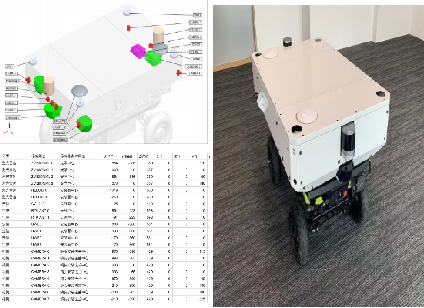
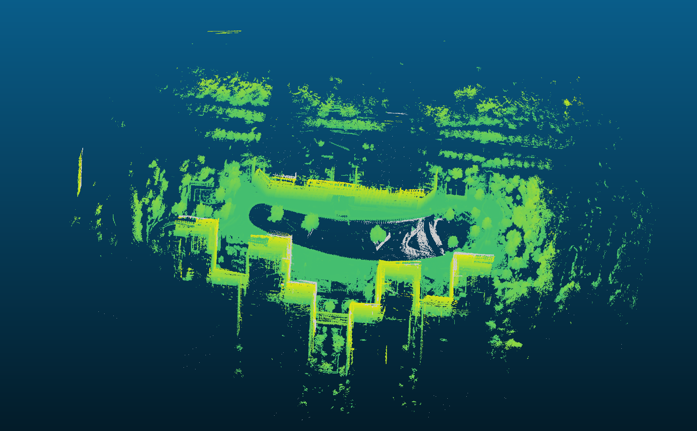

Trajectory tracking 
======
<video width="560" height="315" controls>
  <source src="../videos/car_2/视频1.mkv" type="video/mp4">
  Your browser does not support the video tag.
</video>

<video width="560" height="315" controls>
  <source src="../videos/car_2/视频2.mp4" type="video/mp4">
  Your browser does not support the video tag.
</video>

  

  

  

<video width="560" height="315" controls>
  <source src="../videos/car_2/视频3.mp4" type="video/mp4">
  Your browser does not support the video tag.
</video>

  

<video width="560" height="315" controls>
  <source src="../videos/car_2/视频4.mp4" type="video/mp4">
  Your browser does not support the video tag.
</video>

  

<video width="560" height="315" controls>
  <source src="../videos/car_2/视频5.mp4" type="video/mp4">
  Your browser does not support the video tag.
</video>

<video width="560" height="315" controls>
  <source src="../videos/car_2/视频6.mp4" type="video/mp4">
  Your browser does not support the video tag.
</video>