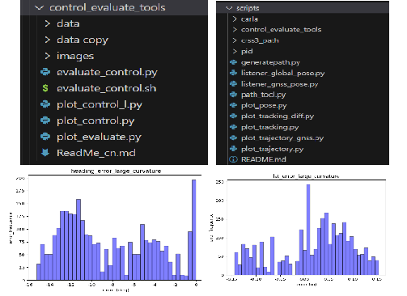

Background

===

Inspired by ETH Zurich's NiftiBot, our lab developed a similar tracked robot designed to achieve autonomous exploration in complex building environments. The robot uses its excellent mobility to independently complete navigation and map construction of the entire building.

Challenges

===

Developing an autonomous exploration framework from scratch is a major challenge, because most existing algorithms for similar robots are not open source. The NiftiBot-inspired robot we developed is a tracked ground robot equipped with four adjustable swing arms. Compared with traditional vehicles, its mobility is significantly enhanced, and it can achieve functions such as climbing stairs and crossing obstacles. Although the track control is relatively simple, how to adjust the swing arms in real time according to the scene to climb over various obstacles is a key technical difficulty.

Contributions

===

- The development of the robot's autonomous navigation framework has been initially completed, covering modules such as perception, planning, localization (completed by other team members) and control.
- Through a large number of field experiments, the robot's autonomous exploration performance in complex environments has been verified, proving its stability and reliability.

Trajectory tracking effect:

<video width="560" height="315" controls>
  <source src="../videos/car_2/视频1.mkv" type="video/mp4">
  Your browser does not support the video tag.
</video>

<video width="560" height="315" controls>
  <source src="../videos/car_2/视频2.mkv" type="video/mp4">
  Your browser does not support the video tag.
</video>

  

  

  
